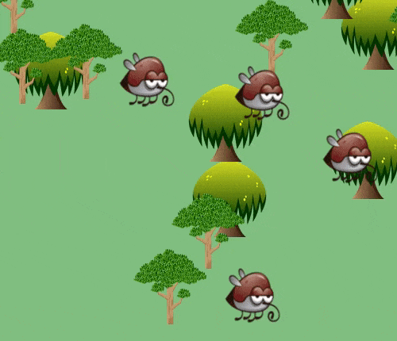

# Random world generator

Build your own randomly generated world!

## Installation

Run `npm install`

## Usage

In the terminal, run the following command:

`npm run start`

## Advanced Usage

- To check your JavaScript with ESlint, run `npm run eslint`

## Assignments

We're going to build a world which we will fill with randomly placed graphical assets.

This could be the first step to building a game!

This project assumes you've already had experience with:
 
- writing HTML and CSS
- using the Math.random() method
- CSS animations (bonus task)

Things we will use / learn:

- interacting with the DOM
- using the document.createElement() method
- using the appendChild() method
- modifying CSS style properties with JavaScript

### Assignment 1 - preparing our body

We want to be able to use the whole page as a 'canvas', meaning we want our graphics to appear everywhere. From the top of the page to the bottom of the page. From the left of the page to the right of the page.

1. Inside the `styles/styles.css` file, modify the `body` style to take the full width and height of the page.

### Assignment 2 - preparing our JS

We need somewhere to store our JavaScript

1. Create a JavaScript file inside the `/js` folder

2. Import your new JavaScript file inside the `index.html`, by using the tag `<script src=""></script>` - replacing the value for `src` with the location of your JavaScript file. Make sure you place this code _after_ the `<body></body>` tag.

### Assignment 3 - beginning with HTML and CSS

Before we can write code that will generate our HTML for us, we must first understand what it is we want to do.

We will manually create some HTML / CSS to help us visualise what it is we want to achieve. After this, we will delete the HTML because we will want to generate this code with JavaScript.

1. Examine the `/images` folder for 3 tree images - `tree-1.png`, `tree-2.png`, and `tree-3.png`

2. Create 3 HTML elements, one for each type of tree

3. Use `position: absolute` to manually position each tree

4. Create the corresponding CSS for those trees. For the `width` and `height` properties, I would recommend values in between `100px` and `200px`. Play around with different values until you're happy with the result.

> Hint: You might want to use CSS properties such as `position`, `background-size` and `background-position`. Try searching online or refer to your previous assignments if you need a refresher on how to use these properties.

Once you are happy with your result, comment out (hide) or delete the HTML tags you've written - but keep the CSS. In the next steps we will use JavaScript to generate the HTML.

### Assignment 4 - beginning with our JavaScript

In the previous assignment, you created 3 HTML elements, each representing a different type of tree. The HTML might look something like this:

```
<div class="tree-1"></div>
<div class="tree-2"></div>
<div class="tree-3"></div>
```

We are going to recreate this in JavaScript.

> Hint: If you need help with any of the following methods, refer to the research links at the bottom  

1. Inside your JavaScript file, use the DOM method `document.createElement()` to create a new HTML object.

Research: [Document.createElement() [English]](https://developer.mozilla.org/en-US/docs/Web/API/Document/createElement)

Research: [Document.createElement() [Deutsch]](https://developer.mozilla.org/de/docs/Web/API/Document/createElement)

2. Use the `setAttribute()` method to set the `class` attribute to the CSS class you created for the first tree.

Research: [Element.setAttribute() [English]](https://developer.mozilla.org/en-US/docs/Web/API/Element/setAttribute)

Research: [Element.setAttribute() [Deutsch]](https://developer.mozilla.org/de/docs/Web/API/Element/setAttribute)

3. Use the DOM method `document.body.appendChild()` to attach your newly created object onto the `<body></body>` tag.

Research: [Node.appendChild() [English]](https://developer.mozilla.org/en-US/docs/Web/API/Node/appendChild)

Research: [Node.appendChild() [Deutsch]](https://developer.mozilla.org/de/docs/Web/API/Node/appendChild)

4. Repeat the above 2 steps for each remaining tree.

If all went well, you should see your 3 trees again.

### Assignment 5 - organising our code

What we did above works great, except, for our world generator we are going to need more than just three trees. In fact, we will want to randomly generate quite a few.

If we look at the code again, we'll see that there is quite a lot of repetition going on. The only difference is the CSS class. Before we can generate more trees we will organise our code.

We could simplify things with a function.

1. Create a function called `generateTree`, which will take the CSS classname as an argument.

2. Rewrite the JavaScript code you created in assignment 4 into the function so that the `createElement()`, `setAttribute()` and `appendChild()` DOM methods are only called once.

3. Write some code to call the function 3 times - one for each tree - passing in each time the corresponding CSS class for each tree.

### Assignment 6 - x, y co-ordinates

Right now the co-ordinates for each tree is hard coded inside our CSS, so that if we want to change the co-ordinates for each tree, we have to change the CSS. We want to be able to set the co-ordinates from our JavaScript.

1. Delete the `left` and `top` properties in your CSS

2. Adapt the `generateTree` function so that it accepts 2 more arguments - `x` and `y`

3. Inside the `generateTree` function, use those `x` and `y` values by setting the `style` properties for your generated HTML object. `x` will correspond to the `left` property, and `y` will correspond to the `top` property. For example, your code might look something like this `htmlObject.style.left = x` (`htmlObject` refers to the object you created).

4. Finally, you will need to pass in the `x`, `y` values from where you call the function. For example

Research: [ElementCSSInlineStyle.style [English]](https://developer.mozilla.org/en-US/docs/Web/API/ElementCSSInlineStyle/style)

### Assignment 7 - Random co-ordinates

Right now the `x` and `y` values we are passing into our function are generated by us - we want these values to be random.

The numbers must be an integer (a whole number).

The range of these numbers must be between 0 and the maximum height / width of  the `<body></body>` tag.

We can use the DOM property `document.body.clientWidth` to find the maximum width of `<body></body>` tag.

We can use the DOM property `document.body.clientHeight` to find the maximum height of the `<body></body>` tag. 

1. Have the computer generate these numbers using the method `Math.random()`.

> Hint: You can multiply the result of `Math.random()` with a number to get a value up to that number. For example, if you need a random number between 0 - 3, `Math.random() * 3`, will give us a random number up to but not exceeding 3.

### Assignment 8 - A random tree type

So far we are generating 3 separate types of tree - manually.

What we want is to generate a random type of tree each time we call the function.

1. Modify the `generateTree` function so that instead of passing in the CSS class of the type of tree you want to create, the function randomly chooses the type of tree

> Hint: You will want to use `Math.random()` again

> Hint: Think about the range of values you might want to generate

> Hint: Think about how you might use the randomly generated value to select a CSS class

2. Remove the CSS class argument from the function, and from where we make the function call - we no longer need it

### Assignment 9 - Creating more trees - with a loop

Each time we want to generate a tree, we have to manually call the function, so that our code might look something like this:

```
generateTree(x, y);
generateTree(x, y);
generateTree(x, y);
```

This is quite repetitive, and if we wanted to do 

1. Use a `for loop` to generate the call to the `generateTree` function. You will have to generate a new random `x` `y` value for each tree.

2. Play around with the number of trees you might want to generate.

### Assignment 10 - preventing overflow in our CSS

You might notice horizontal and vertical scrollbars on the page.

We want to remove this to make for a nicer visual experience.

1. Add the following CSS properties to the `body` element in your CSS

```
overflow-x: hidden;
overflow-y: hidden;
```

This will prevent scrolling on the page

2. You might want to add other CSS properties such as `background-color`

### Assignment 11 - Adding an insect (BONUS)

If you look again at the `/images` folder, you'll notice that there is another file there - `mosquito.png`.

1. Using the techniques you learned from the previous assignments, create a function to generate random insects on the page.

2. Animate the insect using CSS animation properties.

## Preview



## Credits

Graphical assets taken from https://opengameart.org/
