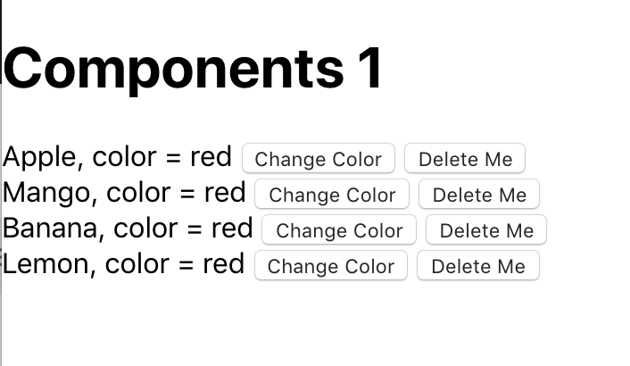

## Instructions for students:

### Create a Fruit Component
1- in APP.js create a  state contain many fruits like this:  const[state,setState]=useState( {
 fruits: ['Apple', 'Mango', 'Banana', 'Lemon']})
 
2-in same way you add state conatin array of colors in same component or child component.

3-to random color need to use Math.random() methode .

4-in case you have a child component dont forget to use props.

5- The user will see a list of 4 fruits, next to each fruit there is color with a color value.
6- The user should be able to click the change color button to change the color - between 5 colors - of that corresponding fruit.
7- The user should be able to click the delete button to delete the line with the fruit and the color. See image below for reference.

8-   Here is an image for reference:
    

9-   Start the project with create react app.

**Bonus**

10-   The user should have the option to delete all

### Rules

-   This is an individual assignment.
-   Deadline: 1 hour.
-   Use **Git properly**
-   Feel free to document your code with comments.
